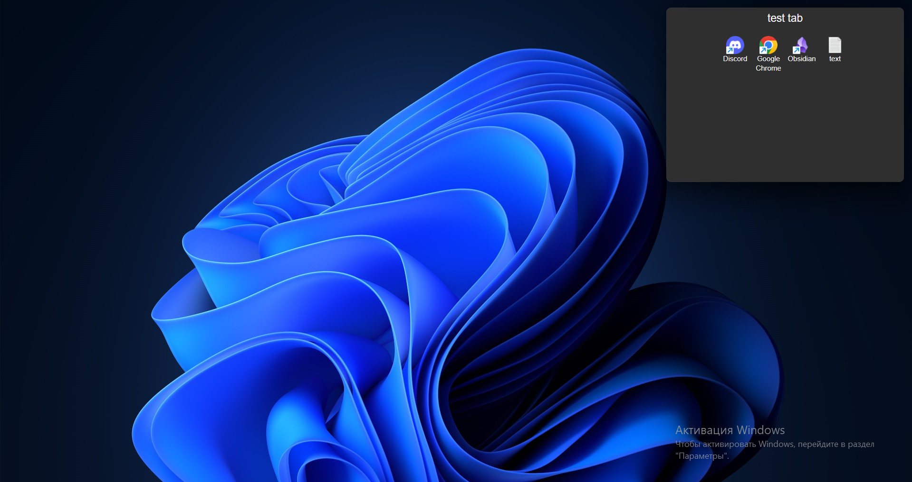

# Mocha-Tabs 
***Application for grouping files on the desktop***

## Installation
1. **Windows**:
    * Download bundler by [releases]()
2. **Other system**:
    * Build from source code with cargo and bun. You need install cargo, bun and source code. Open source code dir in your terminal and run ```bun tauri build```
## Example

|Close|Open|
|-----|----|
||


## License
* [LICENSE-APACHE](LICENSE-APACHE)
* [LICENSE-MIT](LICENSE-MIT)